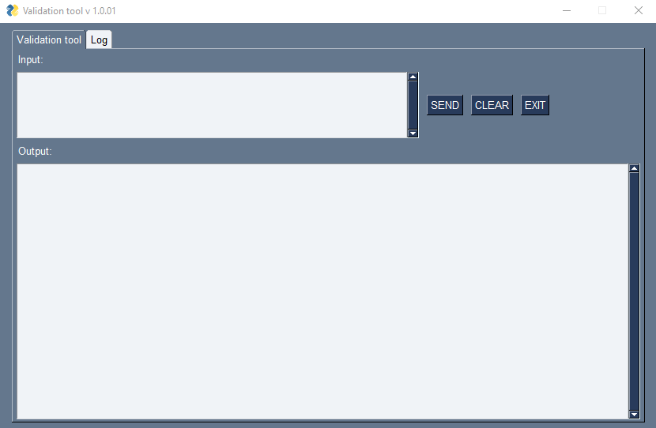

# IPhost_IPsubnet_checker

Simple IPv4 host/network checker writen in Python 3.11.
Script will clean user input a find any IPv4 host network in it. 
Then it will look in its local database if any provided IPv4 host/network is covered by network from database.
Database is loaded from CSV file to pandas dataframe and for searching in records is used itertuples object.

## Features

- clean user input and creat list of IPv4 hosts and networks
- check if IPv4 host or subnet is part of network stored in local database

